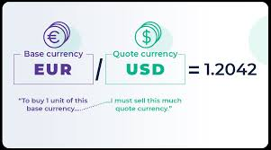

# Cryptocurrency Strategy Backtester

[[_TOC_]]

## 1. Abstract

Our proposed semester-long project aims to create specialized backtesting software for cryptocurrencies. The existing software, RCM-X Strategy Studio, lacks support for cryptocurrency assets due to their sub-penny pricing, therefore, the users had to manually adjust prices by multiplying them to maintain a minimum tick size of one cent. Additionally, Strategy Studio lacks features related to latency differences and exchange-specific latency configuration. Hence, this semester, our group is dedicated to develop backtesting software specifically for cryptocurrencies, incorporating more user-configurable variables.

## 2. Introduction

### 2.1 Team Profile

**Min Hyuk (Michael) Bhang**

I am Min Hyuk (Michael) Bhang, an undergraduate majoring in Industiral Engineering (Track option: Economics and Finance) and minoring in Computer Science at the University of Illinois at Urbana-Champaign. My professional industry experience includes investigating Fintech utilizing blockchain technology to prevent fraud and anonymize personal data, and connecting crypto consultee with venture capitals and private equities to raise funds for seed and early stages in East Asia. Alongside the industry experience, I have strong interest and background in day-trading cash equities, futures, options, and cryptocurrencies with 5 years of experience. I currently scalp/daytrade NASDAQ futures (NQ) only on a daily basis as a contracted daytrader at a proprietary firm with AUM of $500k.
    
- Email: [mbhang2@illinois.edu](/fin556_algo_market_micro_fall_2023/fin556_algo_fall_2023_group_02/group_02_project/-/blob/main/mbhang2@illinois.edu) 
- LinkedIn: [Min Hyuk Bhang](https://www.linkedin.com/in/michael-bhang/)

**Jiayuan (Jerry) Hong**

I am a proficient software engineer transitioning from full-stack development to system engineering, with a neI am a proficient software engineer transitioning from full-stack development to system engineering, with a newfound passion for C/C++ and CUDA programming. My expertise extends to modern CPU architecture, and I will have valuable experience working on the trade execution system of CME Globex at CME Group, focusing on high-frequency trading performance. Goal-oriented and resourceful, I am committed to moving projects forward, taking responsibility for any challenges and obstacles that arise. I'm so exited to explore the wonderful world of trading systems and I'm ready for the challenges ahead!
- Email: jh79@illinois.edu
- LinkedIn: [Jiayuan Hong](https://www.linkedin.com/in/jiayuan-hong-a624121a0/)

**Zexuan Liu**

This is Ze-Xuan Liu, a third year PhD student interested in operational management. I am currently leading research 
projects in online decision-making and supply chain management. In my spare time, I am a Solana chain ethusiast and 
developing decentralized arbitrage and market making strategies. 

- Email: [zexuanl5@illinois.edu](mailto:zexuanl5@illinois.edu)
- LinkedIn: [Ze-Xuan Liu](https://www.linkedin.com/in/zexuan-liu-b1966119b/)

### 2.2 Terminology

#### 2.2.1 Cryptocurrency

Cryptocurrency refers to a digital or virtual form of currency that utilizes cryptographic techniques for secure financial transactions. Unlike traditional fiat currencies issued by central banks, cryptocurrencies operate on decentralized networks, typically based on blockchain technology. 

Cryptocurrencies are characterized by the following key features:

1. **Decentralization**: Cryptocurrencies are not controlled by any central authority (such as a government or financial institution). Instead, they rely on distributed ledger technology (blockchain) to maintain transaction records across a network of nodes.

2. **Security**: Cryptography ensures the security and integrity of transactions. Public and private keys are used to verify ownership and authorize transfers.

3. **Anonymity**: While transactions are transparent on the blockchain, users’ identities remain pseudonymous. Participants are identified by their wallet addresses rather than personal information.

4. **Limited Supply**: Many cryptocurrencies have a fixed supply cap, ensuring scarcity similar to precious metals. For example, Bitcoin has a maximum supply of 21 million coins.

5. **Volatility**: Cryptocurrency prices can be highly volatile due to factors like market speculation, regulatory changes, and technological developments.

6. **Use Cases**: Cryptocurrencies serve various purposes, including peer-to-peer payments, store of value, smart contracts (via platforms like Ethereum), and decentralized finance (DeFi) applications.

#### 2.2.2 Strategy

A trading strategy is a systematic methodology used for buying and selling in the securities markets. A trading strategy is based on predefined rules and criteria used when making trading decisions ([Hayes, 2022](https://www.investopedia.com/terms/t/trading-strategy.asp)). 

#### 2.2.3 Backtesting

Backtesting refers to the process of evaluating a trading strategy or investment approach using historical data. Traders and investors use backtesting to assess how a particular strategy would have performed in the past, assuming it was applied consistently.

#### 2.2.4 Order Match Engine
An order matching engine (OME) is a software system that matches buy and sell orders from market participants to facilitate the execution of trades.

### 2.3 Market Microstructure

Market microstructure refers to the intricate organizational and operational elements of financial markets that influence the trading of assets. It encompasses the processes related to order placement, price determination, trade execution, and the flow of information within a market.

#### 2.3.1 Exchange

cryptocurrency exchange serves as a digital marketplace where participants can buy, sell, and trade various digital assets. Similar to traditional stock exchanges, these platforms facilitate transactions involving cryptocurrencies. Participants interact through mobile apps or desktop interfaces, executing orders based on market conditions. Cryptocurrency exchanges play a crucial role in providing liquidity, price discovery, and access to a wide range of digital currencies. They act as intermediaries, matching buyers with sellers and ensuring efficient trading.

#### 2.3.2 Security

A security refers to a fungible, negotiable financial instrument that holds some type of monetary value. Within the backtesting software, we use a base-quote notation as shown in the figure above.

#### 2.3.3 Bid and Ask

**Bid Price** 
* The maximum price as which a buyer is willing to pay for a security.
* The best bid price is the highest bid price.
* Represents the demand side of the market.

**Ask (Offer) Price**
* The minimum price at which a seller is willing to sell a security.
* The best ask price is the lowest ask price.
* Represents the supply side of the market.

**Bid-Ask Spread**
* The difference between the best bid and offer (BBO).
* Reflects the cost of trading and represents the profit potential for market makers.
* Narrower spread generally indicates higher liquidity.

#### 2.3.4 Order Book

The order book is a dynamic, real-time electronic record of buy and sell orders organized by price level for a specific security. It plays a central role in market microstructure, providing transparency into the current supply and demand by informing on price, availability, depth of trade, and who initiates transactions. 

Three major components of an order book are: 

* Buy Orders (Bids):
    * Listed in descending order, with the best bid at the top.
    * Accumulation of buy orders at a specific price point can indicate a support level.

* Sell Orders (Asks or Offers):
    * Listed in ascending order, with the best ask presented first.
    * Likewise, accumulation of sell orders at a specific price point can indicate a resistance level.

* Order History:
    * Refers to the historical data of executed trades that have occurred.
    * Provides insights into past transactions and helps traders analyze market behavior.

#### 2.3.5 Latency

Latency refers to the time delay between the initiation (sending out) of a trade and its receival. In our backtester, order submission-reception latency is considered.

#### 2.3.6 Updates

**Trade Update**: Called when trade occurred.

**Quote Update**: Called when top quote (best bid or ask) price and/or size is updated.

**Depth Update**: Called when non-best bid or ask price and/or size is updated.

#### 2.3.7 Market "Maker" vs Market "Taker"

In financial markets, the interplay between liquidity providers and liquidity consumers is fundamental to the efficient functioning of trading systems. Two key roles emerge from this dynamic: market makers and market takers. Each plays a distinct part in shaping market behavior and ensuring the smooth execution of trades.

**Market Making**

Market makers play a crucial role in financial markets. They are like the architects who construct the framework for trading. A market maker’s primary goal is to provide liquidity by continuously offering to buy and sell a particular security by maintaining a tight bid-ask spread. Market makers profit from the difference between these two prices (the spread). They constantly adjust their quotes based on market conditions, ensuring that buyers and sellers can execute trades efficiently. In return for providing liquidity, market makers receive a premium from market takers.

**Market Taking**

Conversely, market takers are the swift actors. Market takers prioritize immediacy over getting the best price, and take the existing bid or ask price set by market makers. By executing trades promptly, market takers ensure that liquidity remains available. 

#### 2.3.8 Fees

*Market makers pay lesser fee (could even get paid) than market takers.*

Cryptocurrency exchanges charge fees for facilitating trades on their platforms. The specific fee structure varies across exchanges and can depend on factors like trading volume, type of order, and membership status. **Makers pay less fee than the takers**, which incentivizes the traders to become market makers and add liquidity to the market.

#### 2.3.9 Trading Rules

Exchanges have trading rules that each orders need to meet to be accepted.

* **Minimum Tick Size**:
    * Refers to the minimum price movement for a given cryptocurrency or stock.
    * Determines how much the price can change in a single step.
    * Smaller tick sizes allow for finer price granularity.

* **Minimum Order Quantity/Value**:
    * Smallest amount of a cryptocurrency that can be bought or sold in a single trade.
    * Ensures that orders contribute meaningfully to market liquidity.

* **Maximum Order Quantity/Value**:
    * Exchanges often impose maximum order quantities to prevent market manipulation and maintain liquidity.
    * These limits vary based on the specific cryptocurrency being traded.

#### 2.3.10 Market Type

In the crypto market, two major market types are spot/margin and perpetual futures.

| **Aspect** | **Spot/Margin** | **Perpetual Futures** |
|--------|-------------|-------------------|
| **Ownership** | Direct ownership | No ownership |
| **Settlement** | Immediate | No contract expiration date; indefinite holding |
| **Leverage** | Partially available for margin | Available (sometimes up to 125x) | 
| **Risk Level** | Low - Mid | High |
| **Liquidation Risk** | Margin call possible if trading on margin | Liquidation possible |

**Spot/Margin**:

* Refers to the direct exchange of cryptocurrencies for immediate delivery and settlement.
* Could use leverage to trade the spot market on a margin.
* When a trader buys a cryptocurrency in the spot market, the trader actually own the asset and can use it (transfer, hold, or use for transactions).
* Transactions are settled “on the spot,” meaning ownership of the asset is transferred immediately.

**Perpetual Futures**:

* Derivative contracts that allow traders to speculate on the price movement of a cryptocurrency without owning the underlying asset.
* Traders don’t own the actual cryptocurrency; they trade contracts representing its value.
* Perpetual futures do not have an expiry date; traders can hold positions indefinitely.
* Perpetual futures allow for leverage, potentially leading to higher profits or losses.

#### 2.3.11 Leverage

Leverage refers to using borrowed capital to open a trading position, allowing traders to control a larger position size than their available capital. In the crypto market, leverage enables traders to amplify both potential gains and potential losses. In the crypto market, there are two types of leverages: cross and isolated.

**Cross Margin**:

* In cross margin mode, your entire account balance is used to margin all open positions.
* P&L from one position can support another position that is close to liquidation.
* Cross margin carries the risk of losing the entire account if liquidation occurs.
* Traders using cross margin must add more funds to prevent liquidation.

**Isolated Margin**:

* In isolated margin mode, you allocate margin specifically to a single position or trading pair.
* Trader transfers funds into the isolated margin for a specific trade, wchi allows traders to manage risk for a specific position by choosing how much margin is allocated to it.
* Only the funds allocated to a position can be liquidated, limiting potential losses.

#### 2.3.12 Order Type

Four major type of orders are: Limit, Market, Stop, and Stop Limit.

**Limit**: 
* Allows investors to buy or sell securities at a specific price in the future.
* Trader sets the maximum or minimum price at which the trader is willing to buy or sell.
* The order will only be filled if the market reaches the pre-defined level.
* Limit orders provide **control over execution price** but **no guarantee of execution**.

**Market**:
* Instructs the exchange to buy or sell immediately at the current market price.
* When placed:
    * If buying, trader will pay a price at or near the posted ask (selling) price.
    * If selling, trader will receive a price at or near the posted bid (buying) price.
* Market orders **guarantee immediate execution** but **not a specific price**.

**Stop**:
* Becomes a market order when the stock reaches a specified price.
* Often used to limit losses or lock in profits.

**Stop Limit**:
* Combines features of stop and limit orders; becomes a limit order when the stock reaches a specified price.
* Trader sets both a stop price (when the order becomes active) and a limit price (the maximum or minimum price you’re willing to accept).

## 3. Tools and Technology

### 3.1 Programming Languages

- **Bash**: A command-line language commonly used in Unix and Linux environments for scripting and automation. It excels at handling system tasks, file operations, and executing commands in a shell environment. It was used primarily for file operations.

- **C++**: A high-performance object-oriented programming language widely used in finance for its efficiency and speed. It was employed to ensure rapid code execution.

- **Python**: A versatile and widely adopted programming language known for its readability and ease of use. Python is often chosen for rapid development (prototyping), data manipulation, and as a general-purpose language.

### 3.2 External Libraries

- **[BOOST](https://www.boost.org/)**: A comprehensive collection of C++ libraries designed to enhance and extend the capabilities of the C++ programming language. These libraries cover a wide range of functionalities, including linear algebra, pseudorandom number generation, multithreading, image processing, regular expressions, and unit testing. 

- **[DOXYGEN](https://www.doxygen.nl/)**: A widely-used documentation generator tool in software development. It automates the generation of documentation from source code comments, parsing information about classes, functions, and variables to produce output in formats like HTML and PDF.

- **[Matplotlib](https://matplotlib.org):** A comprehensive 2D plotting library for Python. It produces publication-quality figures in a variety of formats and interactive environments across platforms. Matplotlib can be used to generate plots, histograms, power spectra, bar charts, error charts, scatterplots, and more. It serves as the foundation for many other plotting libraries and is highly customizable.

- **[Pandas](https://pandas.pydata.org/):** A powerful data manipulation library for Python, providing data structures like DataFrames that are essential for handling and analyzing structured data efficiently. It was used for data manipulation. 

- **[RapidJSON](https://rapidjson.org/)**: A powerful JSON parser and generator designed specifically for C++. We utilized it to read exchange configuration JSON file quickly.

## 4. Backtesting Algorithm

1. Market data parser reads data line by line.

2. Update order book data accordingly, and check if any of the user's order resting on the orderbook has been filled either partially or fully.

3. User's strategy's function is called based on the update type.

4. If user submitted new order(s) add them to the current orders.

5. Check if order arrived at the exchange (based on sending latency).

6. Check if order could be filled immediately.

7. Record user's trades that took place.

Once the backtesting is over, list of trades is outputted to the CSV file to aid further data manipulation/analysis for the user.

## 5. Latency Analysis

Current version of latency analysis performs backteset given hypothetical sending latency of 0, 10, 25, 50, 100, 200, 500, 1000 nanoseconds. Then the software outputs the latency vs P&L CSV file as well as the log-latency vs P&L plot to visualize the effect of latency to the user's strategy.

## 6. Future Work

1. Class Exchange: More Freedom in Latency Configuration

    * Latency, in fact, is not set throughout the backtesting period, but could vary based on time of day, and day of week.
    * We plan to have a method for the user to be able to configure latency more freely and realistically.

2. Class Order: Ensure Exchange's Market Type Supports Certain Order Type

    * There could be a case where some exchange does not support certain order type in a certain market type.
    * Further research needs to be done to identify and include these restrictions.

3. Class Order: Advanced Order Types

    * There are more advanced order types that has not been yet implemented such as trailing stop, or one-cancels-other (OCO).

4. Class Order: Rate Limit

    * When trading through an API, exchanges have rate limit, which limits the number/weight of API calls in a given rolling time window.
    * Further research needs to be done to implement rate limit feature, which has different allowance per user level and different rate per different API calls.

5. Class User: Add Restriction per Subaccount

    * User can have multiple subaccounts, and there can be restriction on those subaccounts, for example, this account can only trade spot without leverage.

6. Class User: Risk/Position Management per Firm/User/Subaccount

    * Suppose a user has two subaccounts that are each long in Spot BTC/USDT and long 10x in BTC/USDT perpetual futures. User has great exposure to risk regarding the price movement of BTC/USDT.
    * Implement a method to return or visualize the exposure to certain security.

7. General: Exception Logger

    * Currently, a fatal error (such as not meeting trade rules) throws an exception.
    * We would like to have an error logger that could record all these errors.

## 7. Project Reflections
